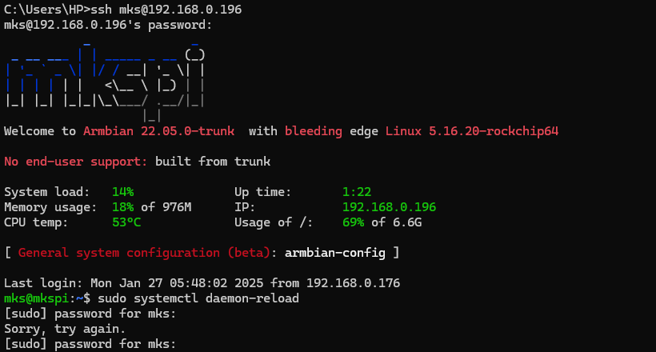
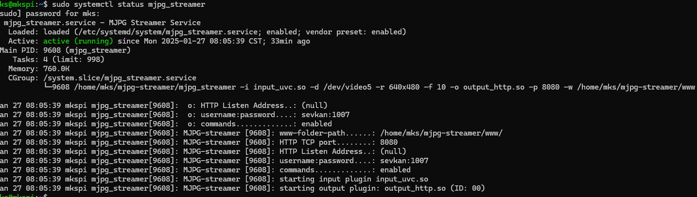
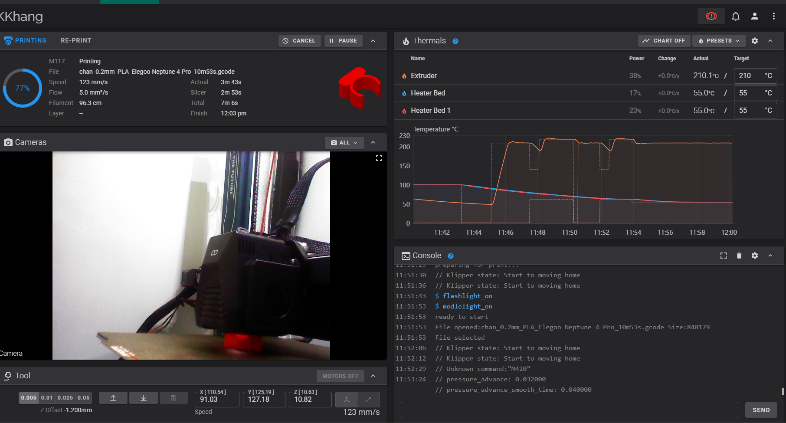

### 📸 MJPG-Streamer Setup & Khắc phục lỗi (Trên mkspi)

---

#### 1. Cài MJPG-streamer và Enable Webcamd

Đầu tiên cần kết nối chung mạng nội bộ với máy in, sau đó dùng lệnh:

```bash
ssh mks@[Printer IP Address]
```

Nhập mật khẩu để điều khiển máy in, thông thường mật khẩu mặc định là "makerbase"

Username: mks
Password: makerbase




---

Sau khi đăng nhập thành công, dùng lệnh:

1. Cho phép Webcam (nếu nó yêu cầu nhập mật khẩu thì chỉ nhập như ban đầu)

```bash
sudo systemctl enable webcamd
```

2. Khởi chạy Webcam (nhớ cắm cam vào máy)

```bash
sudo systemctl start webcamd
```

Sau đó setting trên phần mềm Orca Slicer nữa là OK!

---

Hoặc (không khuyến khích):

```bash
sudo apt update
sudo apt install cmake libjpeg8-dev gcc g++ git libv4l-dev -y
cd ~
git clone https://github.com/jacksonliam/mjpg-streamer.git
cd mjpg-streamer/mjpg-streamer-experimental
make
```

Tạo symlink cho dễ gọi:

```bash
ln -s "$(pwd)/mjpg_streamer" ~/mjpg-streamer/mjpg_streamer
```

---

#### 2. Kiểm tra camera và xác định thiết bị (ĐẶC BIỆT NÀY RẤT DỄ LỖI KHI THÁO RA CẮM VÀO)

```bash
v4l2-ctl --list-devices
```

Tìm USB camera:

```
USB 2.0 Camera:
    /dev/video5
    /dev/video6
```

---

#### 3. Test chạy thủ

```bash
cd ~/mjpg-streamer
./mjpg_streamer -i "./input_uvc.so -d /dev/video5 -r 640x480 -f 10" -o "./output_http.so -p 8080 -w ./www"
```

Truy cập:
 `http://<ip>:8080/?action=stream`

---

#### 4. Lỗi thường gặp

| 🔧 Lỗi                                         | ✅ Cách khắc phục                                         |
| ---------------------------------------------- | -------------------------------------------------------- |
| `init_VideoIn failed`                          | Camera sai thiết bị hoặc bị chiếm                        |
| `Device or resource busy`                      | Dừng tiến trình: `sudo kill -9 $(fuser /dev/videoX)`     |
| `Unable to set format`                         | Camera không hỗ trợ MJPG, thử YUYV hoặc đổi độ phân giải |
| Service failed                                 | Quên dấu nháy trong `ExecStart`                          |
| `input_uvc.so: cannot open shared object file` | Thiếu thư viện, xem phần lỗi thư viện bên dưới           |

---

#### 4.1. Lỗi thư viện MJPG-streamer

##### Lỗi: `input_uvc.so: cannot open shared object file`

Nguyên nhân: thiếu thư viện hoặc build sai thư mục.

Cách xử lý:

```bash
sudo apt install libv4l-dev libjpeg8-dev -y
cd ~/mjpg-streamer/mjpg-streamer-experimental
make clean && make
```

Nếu vẫn lỗi, hãy kiểm tra có tồn tại file `input_uvc.so` trong thư mục hiện tại:

```bash
ls | grep input_uvc.so
```

Nếu không có, bạn cần build lại đúng thư mục `mjpg-streamer-experimental`

---

#### 5. Tạo systemd service (do ghi chạy 1 lúc nó bị crash nên cần tạo service để tự khởi động khi bị crash)

```bash
sudo nano /etc/systemd/system/mjpg_streamer.service
```

Nội dung:

```ini
[Unit]
Description=MJPG Streamer Service
After=network.target

[Service]
ExecStart=/home/mks/mjpg-streamer/mjpg_streamer -i "input_uvc.so -d /dev/video5 -r 640x480 -f 10" -o "output_http.so -p 8080 -w /home/mks/mjpg-streamer/www -c username:password"
Restart=always
RestartSec=5
User=mks
WorkingDirectory=/home/mks/mjpg-streamer

[Install]
WantedBy=multi-user.target
```

LƯU Ý: username và password này là yêu cầu khi truy cập dashboard, khác với yêu cầu của ssh

Lưu file, sau đó:

```bash
sudo systemctl daemon-reexec
sudo systemctl daemon-reload
sudo systemctl enable mjpg_streamer
sudo systemctl start mjpg_streamer
sudo systemctl status mjpg_streamer
```

Nếu lệnh

```bash
sudo systemctl status mjpg_streamer
```

thành công thì nó sẽ báo như sau:




---

#### 6. Rút/gắn lại camera

Camera có thể bị đổi `/dev/videoX`. Kiểm tra lại:

```bash
v4l2-ctl --list-devices
```

Sau đó sửa lại file `.service` theo thiết bị video mới.

---

#### 7. Dùng đường dẫn cố định theo ID

```bash
ls -l /dev/v4l/by-id/
```

Kết quả ví dụ:

```
usb-USB_Camera_123456-video-index0 -> ../../video5
```

Sửa trong service:

```ini
-d /dev/v4l/by-id/usb-USB_Camera_123456-video-index0
```

---

#### 8. Truy cập stream

* Trang giao diện: `http://<ip>:8080`
* Xem trực tiếp: `http://<ip>:8080/?action=stream`
* Dùng port forwarding hoặc ngrok để xem từ xa

---

#### 9. Cài đặt camera cho máy in 3D trong OrcaSlicer

1. Mở phần mềm **OrcaSlicer**.
2. Vào **Printer Settings** > chọn máy in bạn muốn cấu hình.
3. Chuyển sang tab **Webcam**.
4. Tick chọn **Enable webcam support** để bật webcam.
5. Nhập:

   * **Stream URL**: `http://<ip>:8080/?action=stream`
   * **Snapshot URL**: `http://<ip>:8080?action=snapshot`
6. Bấm **Apply** để lưu.

> Sau khi cấu hình, bạn có thể xem trực tiếp webcam trong phần giao diện in ấn.


📌 **Mẹo thêm từ video:**

* Nếu camera bị đứng hình hoặc chậm, hãy giảm FPS xuống (ví dụ: 10 FPS). Hoặc trong setting của app chọn "MJPEG Stream" để hình ảnh mượt hơn do được stream trực tiếp
* Độ phân giải phù hợp thường là 640x480 để giảm tải cho board SBC yếu (như máy cũ).
* Bạn có thể chạy `htop` để kiểm tra mức sử dụng CPU trong khi phát stream.

> Tham khảo: [YouTube - How to Add Webcam to OrcaSlicer](https://www.youtube.com/watch?v=zRJhH6yqNMo&list=WL&index=1)

---
